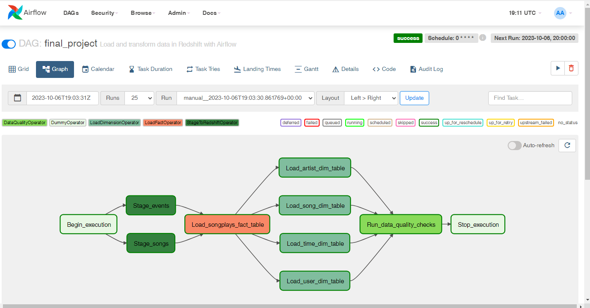

# Data-Pipelines-Project

## Introduction

A music streaming company, Sparkify, has decided that it is time to introduce more automation and monitoring to their data warehouse ETL pipelines and come to the conclusion that the best tool to achieve this is Apache Airflow.

They have decided to bring you into the project and expect you to create high grade data pipelines that are dynamic and built from reusable tasks, can be monitored, and allow easy backfills. They have also noted that the data quality plays a big part when analyses are executed on top the data warehouse and want to run tests against their datasets after the ETL steps have been executed to catch any discrepancies in the datasets.

The source data resides in S3 and needs to be processed in Sparkify's data warehouse in Amazon Redshift. The source datasets consist of JSON logs that tell about user activity in the application and JSON metadata about the songs the users listen to.

## Prerequisites:

Create an IAM User in AWS.
Follow the steps on the page Create an IAM User in AWS in the lesson Data Pipelines.
Configure Redshift Serverless in AWS.
Follow the steps on the page Configure Redshift Serverless in the lesson Airflow and AWS.

## Setting up Connections
Connect Airflow and AWS
Connect Airflow to AWS Redshift Serverless

## Project Details
### Datasets
- Log data: ```s3://udacity-dend/log_data```
- Song data: ```s3://udacity-dend/song_data```

#### Copy S3 Data

Using the command, copied the required data to my bucket "shruti-1514"
aws s3 cp s3://udacity-dend/log-data/ s3://shruti-1514/log-data/ --recursive
aws s3 cp s3://udacity-dend/song-data/ s3://shruti-1514/song-data/ --recursive

### Project Template

The project template package contains three major components for the project:
1. The dag template has all the imports and task templates in place, but the task dependencies have not been set
2. The operators folder with operator templates
3. A helper class for the SQL transformations

   
## Implementation

### Airflow DAG

<figure>
  
</figure>

### Building the operators:

1. Stage Operator -  Extract data from S3 to Redshift staging tables.
2. Fact and Dimension Operators
     - Load data from staging tables to fact table.
     - Load data from staging tables to dimension tables.
3. Data Quality Operator - Running data quality checks by checking if the count of records are greater than zero
